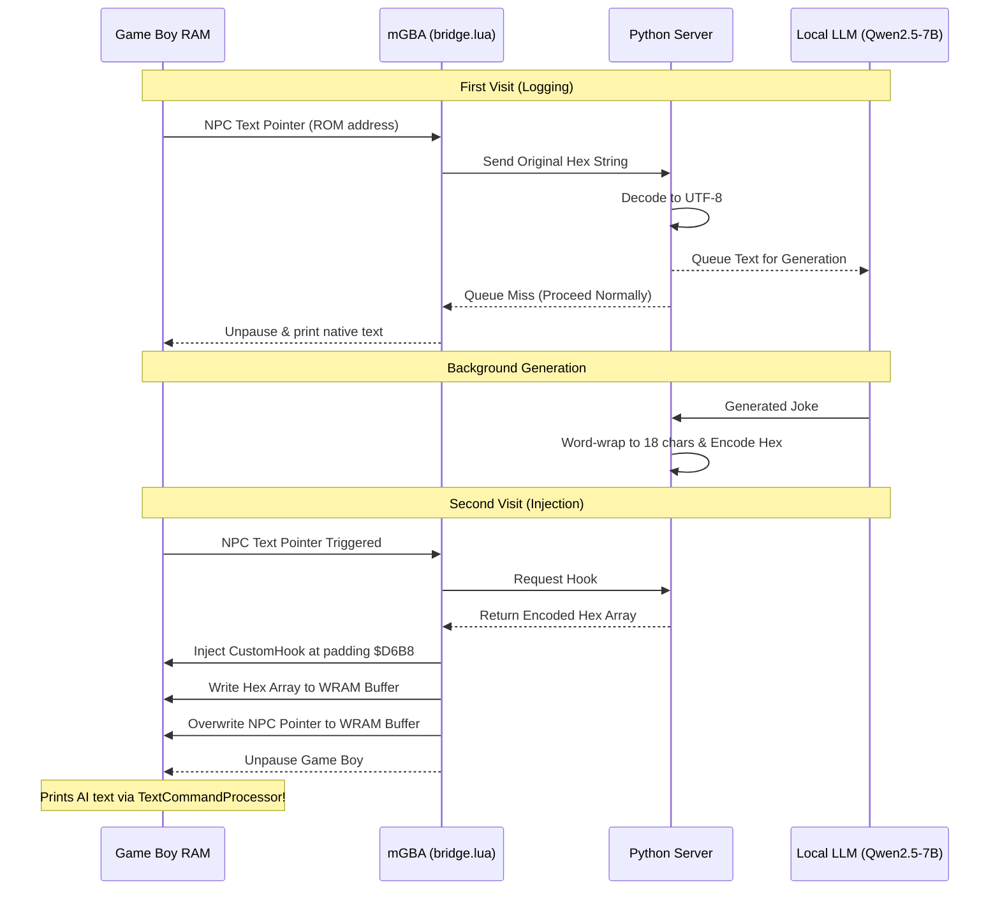
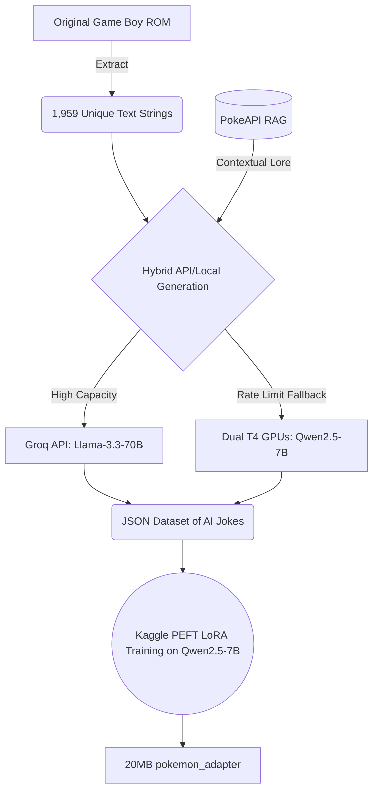

# Pok-AI-mon Red: Dynamic LLM NPCs 🕹️🤖

> [!WARNING]
> **COMPATIBILITY WARNING:** This mod only works with **Pokémon Red (USA, Europe) v1.0** for the original Game Boy (`.gb`). Don’t try it with Fire Red (GBA), Blue, or any v1.1 revision—it won’t work.
> 
> To patch your ROM safely, make sure your file matches these exact checksums:
> - **MD5:** `3d45c1ee9abd5738df46d2bdda8b57dc`
> - **SHA-1:** `ea9bcae617fdf159b045185467ae58b2e4a48b9a`

What’s happening here? This project replaces every NPC dialogue line in the original Game Boy Pokémon Red with witty, on-the-fly text generated locally by a Large Language Model (LLM). No need for romhacks or pre-rendered text. All the LLM magic runs in real-time, injecting new lines right into the Game Boy’s RAM.

## 🚀 How It Works

Everything happens at the emulator level, so here’s how the pipeline plays out:

1. **Memory Hijacking (`bridge.lua`)**: This script runs in the mGBA emulator and hooks into the Game Boy’s `TextCommandProcessor`. When an NPC is about to talk, the emulator pauses, grabs the ROM text pointer, and dumps it to a local Python server.
2. **Text Decoding (`charmap.py`)**: Pokémon Red’s text uses a weird Gen 1 character map, not ASCII. The script converts this hex soup into standard UTF-8 so the AI can read and write it.
3. **AI Inference (`server.py`)**: The server feeds the sanitized text into a snappy, locally running small language model (think **Qwen2.5-7B**). The AI reads the scene and spits out a brand new, totally original line for the NPC.
4. **Game Boy Word Wrapping**: Since the text box only fits 18 characters per line, the server auto-wraps and injects perfect assembly-level control codes (`0x4F` for line breaks, `0x51` for paragraphs), so you never get stuck or softlock the game.
5. **Memory Injection**: Once the AI’s response is ready, the system shoves it right back into WRAM, finishing with double `@` (`0x50`) commands to restart the `TextCommandProcessor` and resume your game.

## 🧠 The Training Pipeline

To keep things funny and true to Pokémon’s world, this repo comes with a serious fine-tuning setup (even Kaggle-ready) to train a custom LoRA adapter:

- **Hybrid Dataset Generation**: It rewrites all the game’s 1,959 unique strings using a two-model approach. First, it leans on the massive **Llama-3.3-70B** model through the Groq API for top quality. If the API starts throttling, it instantly swaps to a local **Qwen2.5-7B** model running on dual T4 GPUs—no waiting, no hang-ups.
- **PokeAPI RAG**: The data pipeline taps into `PokeAPI` for real-time Retrieval-Augmented Generation. Whenever a Pokémon gets mentioned, it grabs fresh elemental typings on the spot and folds them into the AI’s prompt, which keeps the jokes contextually sharp.

## ⚙️ How to Run

**Start the Single-Click GUI:**
- Open `start_ai_pokemon.bat` on Windows.
- The GUI handles Python dependencies for you.

**Patch Your ROM:**
- In the launcher, hit **🔧 Patch ROM** and select your untouched Pokémon Red (USA, v1.0) Game Boy ROM.
- The launcher injects the `CustomHook` into WRAM padding (`$D6B8`) and spits out a new `PokemonRed (AI).gb` file.

**Start the AI Server:**
- Click **▶️ Start Server** in the launcher.
- The server pre-generates lines for upcoming towns and loads the local language model.

**Connect the Emulator:**
- Open the new `(AI).gb` ROM in **mGBA**.
- Go to **Tools > Scripting**.
- Copy the Lua script path from the launcher and run `bridge.lua` in mGBA.
- Hit **Run**.

**Try Talking to an NPC:**
- **First time around**, you’ll hear the classic, original dialogue (like “PROF. OAK, next door…”). While you play, the Python server logs the chat and crafts a joke for later.
- **Second visit?** Walk away, come back, talk to them again—and now you’ll see a totally original, AI-generated reply instead.
