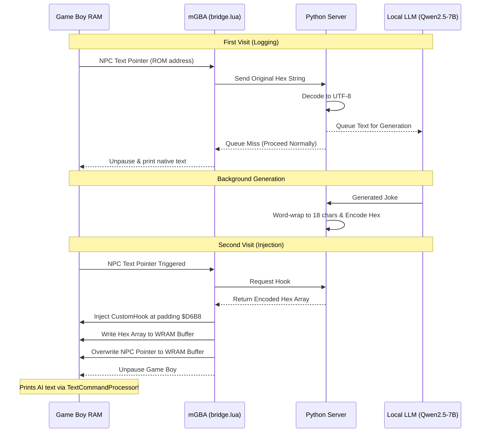
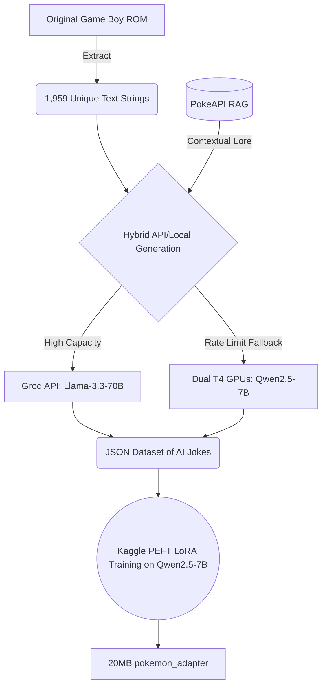

# Pok-AI-mon Red: Dynamic LLM NPCs 🕹️🤖

> [!CAUTION]
> **Heads up**
> 
> **COMPATIBILITY WARNING:** This mod only works with **Pokémon Red (USA, Europe) v1.0** for the original Game Boy (`.gb`). Don’t try this with Fire Red (GBA), Blue, or any v1.1 revisions—it won’t work.
> 
> You need a ROM with these exact checksums before you patch anything:
> - **MD5:** `3d45c1ee9abd5738df46d2bdda8b57dc`
> - **SHA-1:** `ea9bcae617fdf159b045185467ae58b2e4a48b9a`

What does this do? Basically, it takes over the original Game Boy Pokémon Red’s text system. Normal NPC dialogue gets thrown out and replaced, in real time, with witty, situational lines generated by a local Large Language Model (LLM).

No need for romhacks. No pre-set new lines. The AI writes dialogue live, and it’s injected right into the Game Boy’s RAM as you play.

## 🚀 How It Actually Works

Here’s how the magic happens—it intercepts the emulator and funnels all game text through its own AI pipeline:

1. **Memory Hijacking (`bridge.lua`)**: Runs inside the mGBA emulator. It latches onto the `TextCommandProcessor`. When an NPC is about to talk, the script pauses the emulator, grabs the ROM’s text location, and sends the info to a Python server running on your computer.
2. **Text Decoding (`charmap.py`)**: Pokémon Red doesn’t use regular ASCII for text. It has its own character map, so this script converts Game Boy text into standard characters and back, making it readable for the AI.
3. **AI Inference (`server.py`)**: The decoded line heads to a fast, local Small Language Model (**Qwen2.5-7B**). The AI reads the context and makes up a fresh response on the spot.
4. **Game Boy Word Wrapping**: Since the text box is only 18 characters wide, the Python server picks exactly where to break lines and injects Game Boy control codes (`0x4F` for line breaks, `0x51` for paragraphs). This keeps the game from glitching out.
5. **Memory Injection**: Once the AI spits out a formatted line, the server shoves it back into the Game Boy’s WRAM. It ends with two `@` (`0x50`) commands, which signals the game to keep going and unpause the emulator.

## 🧠 Training the AI

To keep the AI funny and true to Pokémon lore, there’s a custom fine-tuning pipeline set up for **Kaggle**, letting you train a custom **Qwen2.5-7B LoRA adapter**.

- **Hybrid Dataset Generation**: The pipeline rewrites all 1,959 original in-game text lines. It uses the beefy 70-billion parameter **Llama-3.3-70B** model through the Groq API for quality. If there are too many calls, it falls back to a local **Qwen2.5-7B** model running on dual T4 GPUs, so you never have to wait.
- **PokeAPI RAG**: Whenever a line mentions a specific Pokémon, it automatically looks up the Pokémon’s stats or type on PokeAPI and adds it to the prompt, making the AI’s jokes more clever and accurate.

## ⚙️ How to Set It Up

There’s a simple Windows GUI to launch everything:

1. Double-click `start_ai_pokemon.bat`.
2. The GUI handles Python installs and dependencies for you.

**Patching Your ROM:**
1. In the launcher, click **🔧 Patch ROM** and choose your clean Pokémon Red (USA, v1.0) Game Boy ROM.
2. The launcher injects the custom hook into WRAM (`$D6B8`) and outputs `PokemonRed (AI).gb`.

**Start the AI Server:**
1. Click **▶️ Start Server** in the launcher.
2. The server pre-generates text for upcoming areas and loads the language model.

**Connect the Emulator:**
1. Open the patched `(AI).gb` ROM in **mGBA**.
2. Go to **Tools > Scripting** in mGBA.
3. Copy the Lua script path from the launcher and load `bridge.lua`.
4. Click **Run**.

**Talk to an NPC!**
- **First time**: The NPC gives their original line (like “PROF. OAK, next door…”). The Python server logs this and writes a new joke behind the scenes.
- **Second time**: Walk away and talk again. This time, the game swaps the dialogue pointer for the WRAM buffer—so you see a completely new line, written by AI, right in your Game Boy game.
